# Neural Pixels MVP

> *Neural Pixels* turns large language models inside-out, slicing their feed-forward blocks into tiny, content-addressed **pixels** of cognition that can be hot-swapped and fused at run-time.  
> On an ordinary laptop this design slashes active parameters by ~100×, pushes throughput past 80 tokens / s, and shifts cost from GPU time to simple storage + bandwidth.

---

## 1  |  Quick-Glance Summary
| Question | Answer |
|----------|--------|
| **What spins?** | A frozen **backbone spine** (attention & layer-norm) plus a handful of **Neural Pixels** (micro-experts) selected for each prompt. |
| **Why bother?** | 1 % of the usual weights ⇒ fits in 1 GB VRAM, runs cool, and costs pennies. Pixels are signed & content-addressed, so they can be shared, cached, and paid for like Docker layers. |
| **Core stack** | LoRA-based *Pixel Forge* → FAISS *Router* → Rust/Python *Runtime* → TVM/IREE on-the-fly fusion. |
| **Who earns?** | Pixel authors stake accuracy, routers earn routing fees, caches earn bandwidth micro-payments. |

---

## 2  |  Mermaid Architecture Diagram

```mermaid
flowchart TD
  %% ──────────────────────  OFF-LINE PIXEL FORGE  ──────────────────────
  subgraph PF["🎨  Pixel Forge (offline)"]
    direction LR
    PF1["Dataset<br/>+ Skill Spec"]:::io
    PF2["LoRA Distillation<br/>(rank = 4)"]:::proc
    PF3["Prune + Quantise<br/>(FP4)"]:::proc
    PF4["Hash & Sign<br/>(BLAKE3 + Schnorr)"]:::proc
    PF5["Skill Vector<br/>(4096-d)"]:::proc
    PF6["(*.npixel)"]:::art
    PF1 --> PF2 --> PF3 --> PF4 --> PF5 --> PF6
  end

  %% ─────────────────────────  LOCAL STORE  ───────────────────────────
  subgraph STORE["💾  ~/.neural_pixels"]
    direction TB
    ST1["npixels/<br/>*.npixel"]:::art
    ST2["skill_index.faiss"]:::art
  end

  %% ──────────────────────────  RUNTIME  ──────────────────────────────
  subgraph RT["🚀  Runtime Daemon"]
    direction TB
    R0["Prompt"]:::io
    R1["Router (ANN search)"]:::proc
    R2{"Pixel IDs"}:::dec
    R3["LRU mmap Cache"]:::store
    R4["TVM / IREE<br/>Kernel Fusion"]:::proc
    R5["Backbone Spine<br/>(Frozen Attention)"]:::art
    R6["GPU / CPU"]:::comp
    R7["Token Stream"]:::io

    R0 --> R1 --> R2 --> R3
    R3 -- hit --> R4
    R3 -- miss --> ST1
    ST1 --> R3
    R1 -. reads .- ST2
    R4 --> R6
    R5 --> R6
    R6 --> R7
  end

  %% ────────────────────────  OPTIONAL CDN  ───────────────────────────
  subgraph CDN["🌐  P2P / CDN Mesh (optional)"]
    CDN1["Remote Pixel Peers"]:::io
  end
  R3 -- miss --> CDN1
  CDN1 --> R3

  %% ─────────────────────────────  STYLES  ────────────────────────────
  classDef io     fill:#fffbe6,stroke:#d9b629,color:#5a4f03,font-weight:bold;
  classDef proc   fill:#e6f7ff,stroke:#2f80ed,color:#064a75;
  classDef art    fill:#f0e6ff,stroke:#8e62e6,color:#301564;
  classDef store  fill:#e8ffe8,stroke:#29a329,color:#064806;
  classDef dec    fill:#ffecec,stroke:#d93636,color:#6d0707;
  classDef comp   fill:#dbf4ff,stroke:#1b8ac9,color:#02466d;
```

